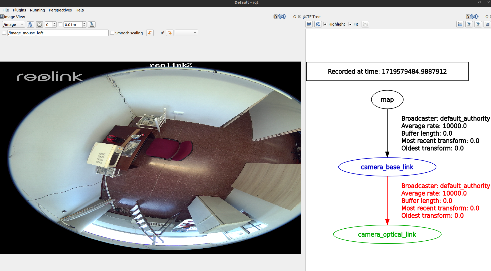

# ip_camera_ros2

[](https://opensource.org/licenses/Apache-2.0)

## Overview
This ROS2 package provides a generic interface for publishing RGB image from any IP camera. I also includes a static transform publisher and camera info publisher in case you need any of these applications.

*RGB image and transform published:*



The ip_camera_ros2 package has been tested under [ROS2] Humble on [Ubuntu] 22.04. This is research code, expect that it changes often and any fitness for a particular purpose is disclaimed.

## Installation
### Building from Source

#### Dependencies

- [Robot Operating System (ROS) 2](https://docs.ros.org/en/humble/) (middleware for robotics),
- [OpenCV](https://opencv.org/) (computer vision library),
- [cv_bridge](http://wiki.ros.org/cv_bridge) (interface OpenCV with ROS)

#### Building

To build from source, clone the latest version from the main repository into your colcon workspace by running the following commands:
```bash
cd colcon_workspace/src
git clone https://github.com/grupo-avispa/ip_camera_ros2.git -b main
```

Then, install the ROS2 dependencies using rosdep and build the package using:
```bash
cd colcon_workspace
rosdep install -i --from-path src --rosdistro humble -y
colcon build --symlink-install
```

## Usage

## Only Image Mode

Connect your ip camera and set up the url in the `params.yaml` file under `config` directory.
```bash
ros2 launch ip_camera_ros2 image.launch.py
```
## Image and TF Mode
Connect your ip camera and set up the url in the `params.yaml` file under `config` directory. Then configure the `camera.xacro` file under `urdf` directory with your needs (template provided) and x, y, z, roll, pitch, yaw and links as the `ipcam_tf_node` arguments in the `image_and_tf.launch.py` file under launch directory.
```bash
ros2 launch ip_camera_ros2 image_and_tf.launch.py
```
### Nodes

#### ip_camera_ros2

This node publishes image from the ip camera and camera information (if this option is enabled).

#### camera_state_publisher
State publisher node from robot_state_publisher package.

#### ipcam_tf

Static transform publisher from tf2_ros package.

### Published Topics

* **`image`** ([sensor_msgs/Image])

	The camera image.

* **`camera_info`** ([sensor_msgs/CameraInfo])

	Defined meta information for a camera.

* **`joint_states`**
* **`robot_description`**
* **`tf_static`**
* **`tf`**

	These topic are generated by the camera_state_publisher and ipcam_tf nodes.

### Parameters

* **`image_topic`** (string, default: "image")

	Topic where the image will be published.

* **`cam_info_topic`** (string, default: "camera_info")

	Topic where the camera info will be published.

* **`image_height`** (int, default: -1)

	Final image height after resize or crop (set to -1 if not used).

* **`image_width`** (int, default: -1)

	Final image width after resize or crop (set to -1 if not used).

* **`offset_x`** (int, default: -1)

	Image X top left corner pixel before crop (set to -1 if not used).

* **`offset_y`** (int, default: -1)

	Image Y top left corner pixel before crop (set to -1 if not used).

	If `image_height`, `image_width`, `offset_x` and `offset_y` are greater than zero, 
	crop image tranformation will be applied. If only `image_height` and `image_width` are greater 
	than zero, resize image tranformation will be applied. If `image_height` and `image_width` are 
	smaller than zero no transformations will be applied.

* **`url`** (string, default: "ipcam_url")

	Url for ip camera connection.

* **`tf`** (string, default: "camera_optical_link")

	Camera selected frame where the image will be published.

* **`frame_rate`** (unsigned int, default: 30)

	Image publishing frame rate in HZ.

* **`enable_cam_info`** (bool, default: false)

	Enables camera info publishing.

* **`camera_matrix`** (double array)
* **`distortion_coefficients`** (double array)
* **`rectification_matrix`** (double array)
* **`projection_matrix`** (double array)

	Meta information about intrinsic and extrinsic parameters of the camera obtained from calibration.


[Ubuntu]: https://ubuntu.com/
[ROS2]: https://docs.ros.org/en/humble/
[sensor_msgs/Image]: https://docs.ros2.org/humble/api/sensor_msgs/msg/Image.html
[sensor_msgs/CameraInfo]: https://docs.ros2.org/humble/api/sensor_msgs/msg/CameraInfo.html